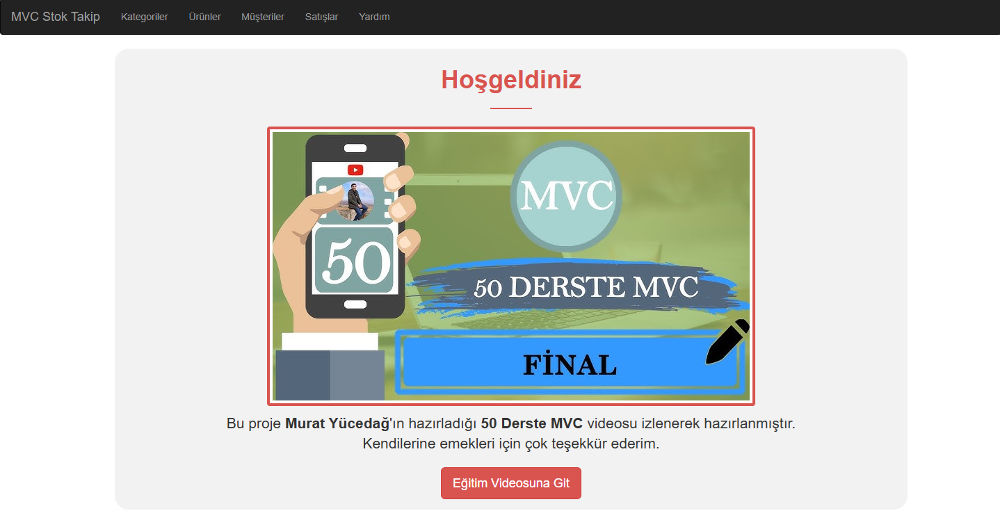
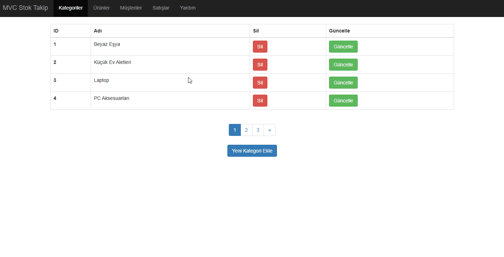
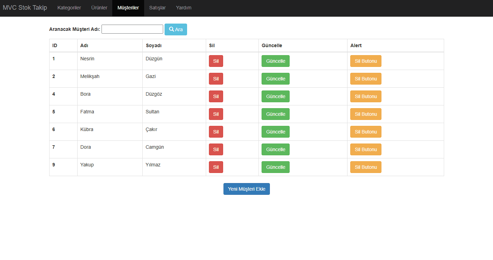
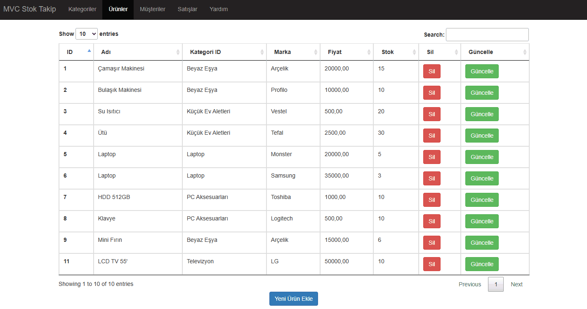
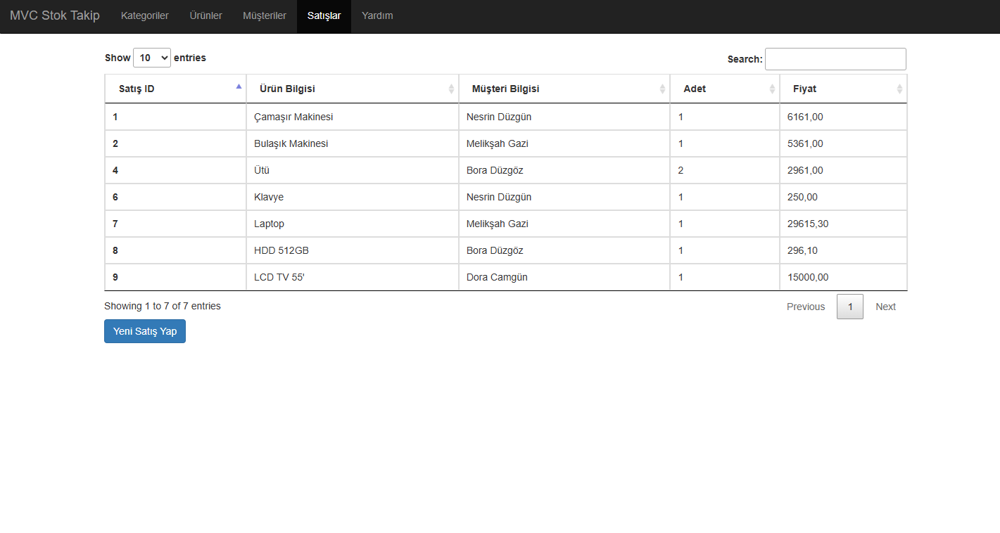
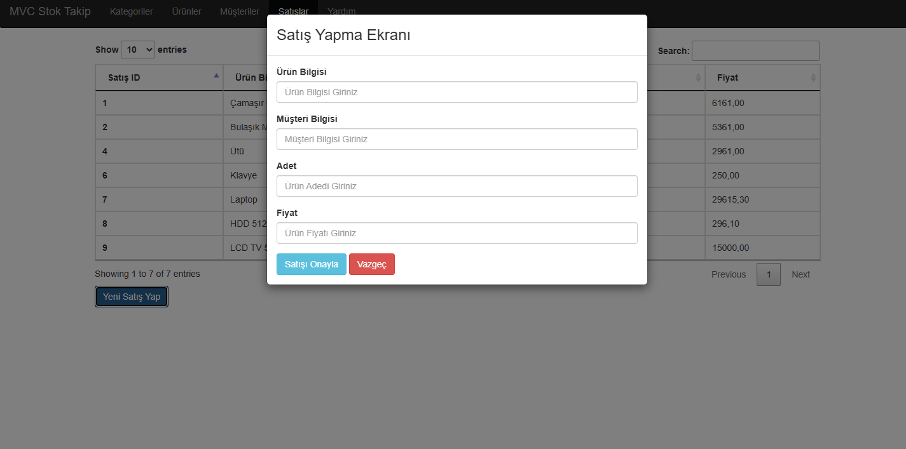
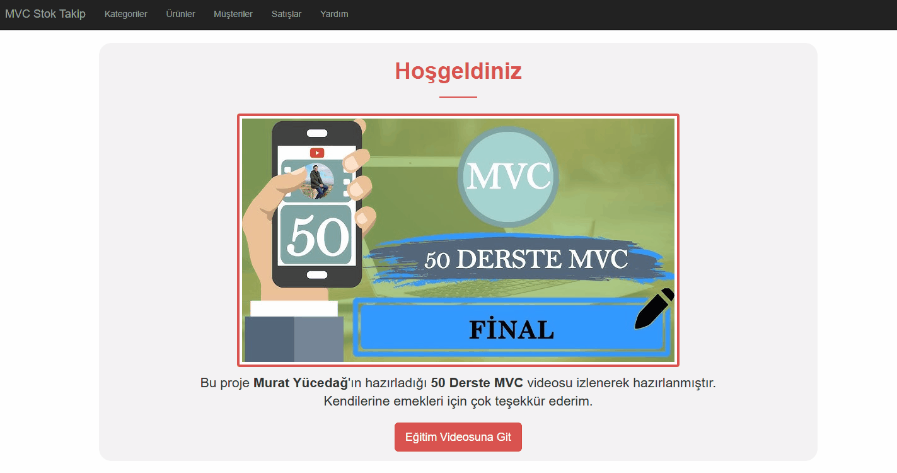

# 🛠️ ASP.NET MVC 50 Ders Projesi

Bu proje, ASP.NET MVC mimarisini öğrenmek ve uygulamalı olarak pekiştirmek amacıyla geliştirilmiş bir çalışmadır. 50 dersten oluşan bir eğitim sürecinde edinilen bilgilerle geliştirilmiştir.

## 🔍 Proje Amacı

- MVC (Model-View-Controller) yapısını öğrenmek
- ASP.NET teknolojisinde pratik kazanmak
- Katmanlı mimari ile uygulama geliştirme mantığını kavramak
- Visual Studio üzerinde gerçek dünya senaryolarını uygulamak

## 🚀 Kullanılan Teknolojiler

- ASP.NET MVC 5
- C#
- Entity Framework
- Razor View Engine
- SQL Server
- Bootstrap (basic styling)

## 🧩 Proje Yapısı

- `Models/` → Veri modelleri
- `Controllers/` → Sayfa yönlendirmeleri ve iş mantığı
- `Views/` → Kullanıcı arayüzü
- `App_Start/` → Route ve config ayarları
- `Web.config` → Uygulama yapılandırma ayarları

## 📸 Ekran Görüntüleri ve Demo

### 🏠 Ana Sayfa


### 📂 Kategori İşlemleri


### 👥 Müşteriler


### 📦 Ürünler


### 💰 Satışlar Sayfası


### 🆕 Yeni Satış Oluşturma


### 💡 Yardım Paneli


## ⚙️ Kurulum

1. Bu repoyu klonlayın:
```bash
git clone https://github.com/Nesrindzg/MVC_50Ders.git
